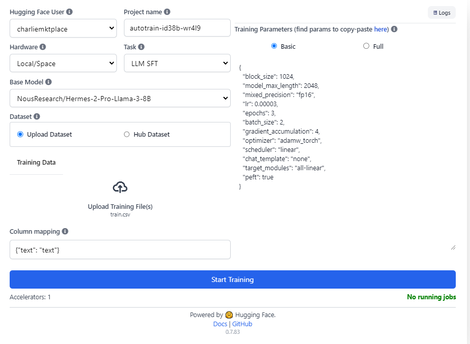
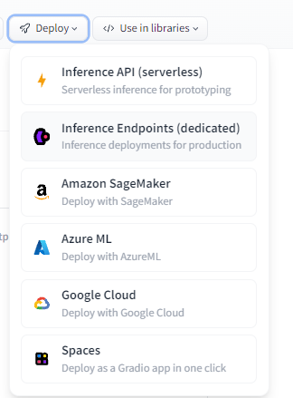

# flippy_ai
 Guides for tuning via HuggingFace Autotrain & Templates for querying endpoints.

# Tuning 

## Training Data

For Large Language Models (LLMs) that seek to generate text matching a set of conditions (e.g., `Instruct` or `Chat` type models), HuggingFace Autotrain includes [LLM finetuning](https://huggingface.co/docs/autotrain/en/llm_finetuning) to customize the behaviors and add knowledge to a base model (e.g., Facebook's open source Llama-3 model).

For Supervised Fine-Tuning (SFT) style training, the data should be provided in a `csv` format with 1 column named `text`. It should have the inputs prefaced with `human: ` and the outputs prefaced with `\n bot: `. Other training formats exist, but for Autotrain the SFT format is required. 

The `training-files/` folder contains both an Excel worksheet for concatenating inputs and outputs with their preface, and a `train.csv` example. It migrates an ALPACA formatted training set (the `alpaca_` columns) to the SFT format under `text`.

```
text
human: hello \n bot: hi nice to meet you
human: how are you \n bot: I am fine
human: What is your name? \n bot: My name is Mary
```

## Autotrain UI

HuggingFace offers an Autotrain UI that uses their transformers package alongside PEFT, pytorch and a few other packages to tune a model and push the tuned modeled directly into your HuggingFace account.

For simplicity the following options were selected:

1. Duplicate the [HuggingFace Autotrainer Space](https://huggingface.co/spaces/autotrain-projects/autotrain-advanced?duplicate=true) to your account, make sure it is `private` to control cost. Select a `GPU`, NVIDIA A10G small is probably fine.
2. Allow the space to load (Docker container takes awhile but is the most consistent setup). 
3. Load the `train.csv` with the `text` column in the SFT format described above and select the base model (recommend: `NousResearch/Hermes-2-Pro-Llama-3-8B`)
    - [NousResearch/Hermes-2-Pro-Llama-3-8B](https://huggingface.co/NousResearch/Hermes-2-Pro-Llama-3-8B) is a professionally tuned model 
4. Wait patiently, the space will pause itself when the new model is pushed to your account.

# 

## Deploying an Endpoint

The Llama-3-8B model is easily deployable on HuggingFace with configurable GPUs, Cuda, etc. For simplicity, you can select a small GPU ( < $2/hr ) and set the pause to 15 or 30 minutes after inactivity to save costs.



## Querying a Model

Both python `inference.py` and JavaScript (`inference.mjs`) example files are provided, note, both the endpoint URL and the API Key are important secrets. 

see `query-model/` for the full code.

The mjs file can be run via `node` for simple local testing. In either instance, the OpenAI package is used to benefit from interacting with the model via a multi-message scheme making it easier to activate certain weights in the tuning layer. Here for example is the system instruction (notice both the first `system` and the first `user` message match the `training-files/`).

Note: A large single model can be trained across different instructions within the same domain to benefit from cross-pollination of weights, while still having key use cases be narrowly accessible through specific system instructions from the tuning. 

```python

chat_completion = client.chat.completions.create(
	model="tgi",
	messages=[
        {
            "role": "system",
            "content": "You are an expert crypto and blockchain analyst versed in Snowflake SQL. You explain code clearly and quickly."
        },
        {
            "role": "user",
            "content": "Given the following SQL code, explain the goals of the code. Do not go line by line. Give a holistic overview of the code. Be concise."
        },
        {
            "role": "system",
            "content": query_to_explain
        }
    ],
	stream=True,
	max_tokens=500
)

for message in chat_completion:
	print(message.choices[0].delta.content, end="")
```

Out-of-Sample Example Response: 
```
The given SQL code is a part of a Snowflake script that aims to provide daily statistics and calculate the fee-to-reward ratio for the Bitcoin network. The holistic goal of this code can be summarized as:

1. Extract relevant data from the table 'bitcoin.gov.ez_miner_rewards' that contains information about block timestamps, block rewards, and fees.
2. Filter out data points that are prior to January 2, 2024, and only include those up to the latest completed day before the current date.
3. Group the filtered data by day (date) and calculate the average block reward, total block reward, average fees, total fees, and fee/reward ratio for each day.
4. Output a summary table containing the day, total block rewards, total fees, and the fee/reward ratio (expressed as a percentage) for each day in the selected time range.
```

